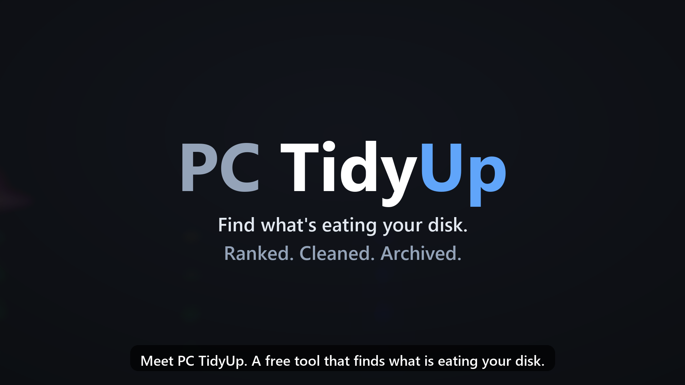

# Productivity tools

[](LICENSE.md)

Small, practical tools that make everyday work on a Windows PC easier. Each tool lives in its own folder, with its own documentation, installer and changelog.

> **Free for personal and other noncommercial use.** Commercial use requires written permission. See [License](#license).
>
> ⚠️ **Use entirely at your own risk.** These tools can change files on your computer. They are provided "as is", without any warranty, and the author accepts no liability for any damage or data loss. Read the **[Disclaimer](DISCLAIMER.md)** before use. Make backups.

## Tools

| Tool | What it does | Install |
|---|---|---|
| **[PC TidyUp](pc-tidy-up/)** | Finds what's eating your Windows disk, ranks it by priority, and lets you clean up, compress or archive to OneDrive from one local page | `irm https://raw.githubusercontent.com/MZade/productivity-tools/main/pc-tidy-up/install.ps1 \| iex` |

[](pc-tidy-up/)

## Repository layout

```
productivity-tools/
├── LICENSE.md, DISCLAIMER.md   apply to every tool in this repository
├── SECURITY.md                 how to report a vulnerability
└── <tool>/                     one folder per tool: README, docs, installer, changelog, its own license copy
```

## License

Copyright © 2026 **Mehrdad Ghazvinizadeh**. All rights not expressly granted are reserved.

All tools in this repository are licensed under the **[PolyForm Noncommercial License 1.0.0](LICENSE.md)**: free for personal and other noncommercial use. Any commercial use of a tool or any part of it requires prior written permission. For commercial licensing, contact the author through [his GitHub profile](https://github.com/MZade).

The tools are provided **as is, without any warranty**, and are used **entirely at your own risk**. See the **[Disclaimer](DISCLAIMER.md)**.
