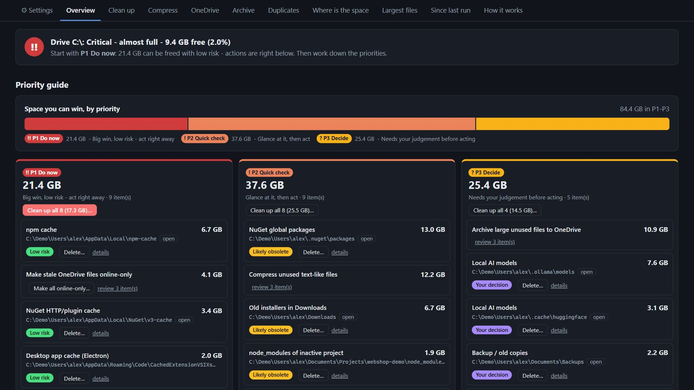
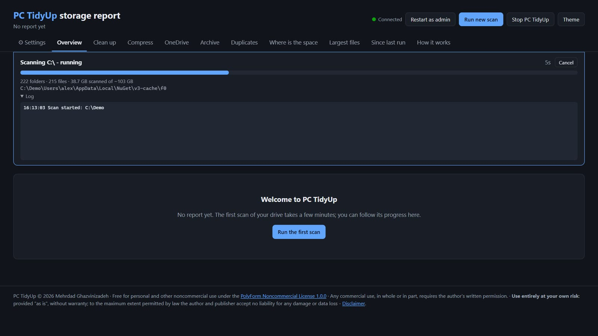
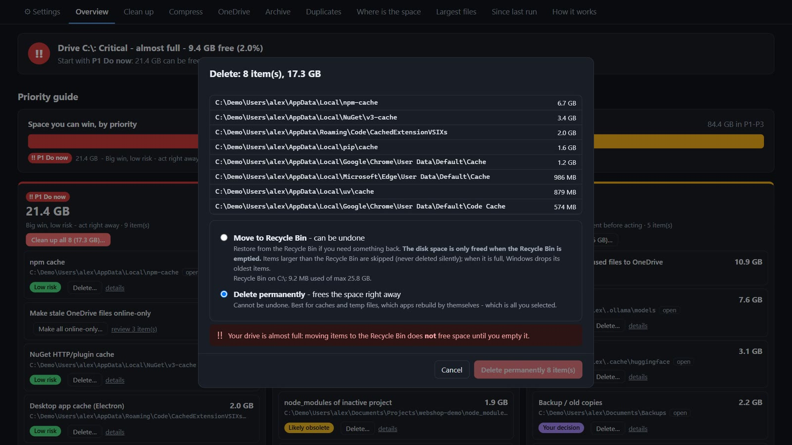
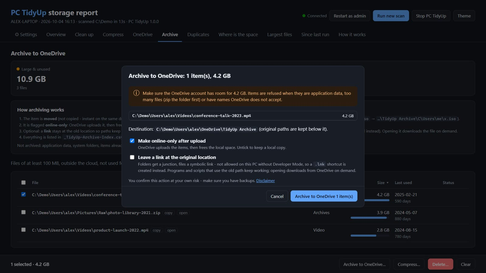
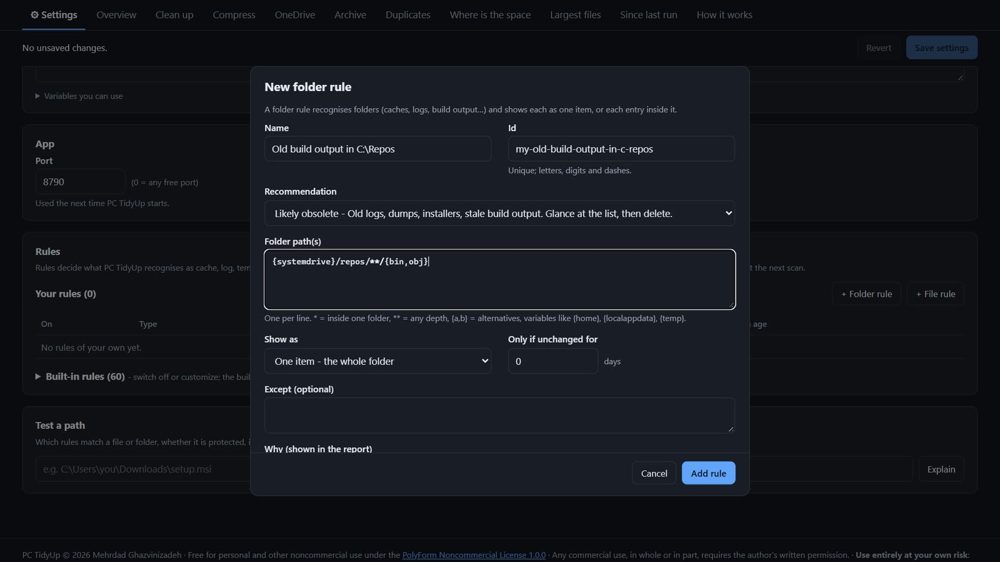

# PC TidyUp

[](LICENSE.md)


**Find what's eating your Windows disk, see what matters first, and fix it from one page.**

PC TidyUp scans your drive, recognises caches, logs, temp files, old installers, stale build output and duplicates, and ranks everything by priority. You can then clean up, compress, archive to OneDrive or make files online-only straight from the report, with live progress. It runs entirely on your own PC: no cloud service, no telemetry, no installation.

> **Free for personal and other noncommercial use.** Commercial use requires written permission. See [License](#license).
>
> ⚠️ **Use entirely at your own risk.** PC TidyUp can delete, move and change files. It is provided "as is", without any warranty, and the author accepts no liability for any damage or data loss. Read the **[Disclaimer](DISCLAIMER.md)** before use. Make backups.



▶ **[Watch the 40-second teaser](docs/promo/PC-TidyUp-LinkedIn-Teaser.mp4)**

## Features

- **Priority guide**: a disk health verdict and three lanes. **P1 Do now** (big and low risk), **P2 Quick check** and **P3 Decide**, each with a one-click "Clean up all".
- **59 built-in rules**: npm/NuGet/pip/uv caches, browser and Electron caches, Windows temp and update caches, crash dumps, old logs, old installers in Downloads, `node_modules`/`bin`/`obj` of inactive projects, AI models, and more.
- **Act from the page**, with live progress and a ✓/✗ result per item:
  - **Delete**: to the Recycle Bin (undoable) or permanently.
  - **Compress**: ZIP with verification, or transparent NTFS compression.
  - **Archive to OneDrive**: moved under one archive folder, made online-only, optionally with a link left behind.
  - **Make online-only**: OneDrive "Free up space".
- **Where is the space**: an expandable folder tree, file types, last-use age, largest files and duplicates.
- **Since last run**: what grew or shrank between scans.
- **Settings in the page**: thresholds, protected folders, the archive root and your own rules, with validation, plus a "Test a path" helper.
- **Repeatable**: a headless scan, a weekly scheduled task, and a generated PowerShell cleanup script that's a dry run by default.

## Quick start

New to this? Follow the **[step-by-step getting-started guide](docs/getting-started.md)**.

1. Install **Python 3.9 or newer** (`winget install Python.Python.3.12`). Nothing else is needed; PC TidyUp uses only the standard library.
2. Get PC TidyUp in one of two ways:
   - Click **Code → Download ZIP**, then right-click the ZIP → *Properties* → **Unblock**, and extract it.
   - Or clone it:
     ```powershell
     git clone https://github.com/MZade/productivity-tooling-pc-tidy-up.git
     ```
3. Double-click **`PC-TidyUp.cmd`**. The report opens in your browser at `http://127.0.0.1:8765`.
4. Click **Run the first scan**. A full drive takes a few minutes.
5. Start with **P1 Do now**, then work down the priorities.

Keep the console window open while you use the page. The app stops by itself 20 minutes after the last page is closed. To include system folders such as `C:\Windows\Temp`, use **Restart as admin** on the page.

| Live scan | Clean up with confirmation |
|---|---|
|  |  |
| **Archive to OneDrive** | **Your own rules** |
|  |  |

## Safety first

PC TidyUp works with your files, so safety is built in:

- **Nothing happens without your confirmation.** Scanning only reads. Deletes ask you to choose Recycle Bin or permanent, and a permanent delete needs an extra confirmation tick.
- **Ages are re-checked right before acting.** Anything that changed recently is kept.
- **Protected locations:** `C:\Windows`, Program Files, ProgramData, application data, `.git` folders and your profile root are never touched by file actions.
- **Only reported items:** the local app acts only on items listed in the current report. It listens only on `127.0.0.1` and requires a per-session token.
- **OneDrive online-only files** are recognised from their attributes and never opened, so nothing gets downloaded.
- **Audit trail:** every action is logged in `reports\actions.log`, and archive moves can be restored.

More in [How it works](docs/how-it-works.md).

## Documentation

| | |
|---|---|
| [Getting started](docs/getting-started.md) | Step by step: install Python, download, first run, update, uninstall |
| [Troubleshooting & FAQ](docs/troubleshooting.md) | Common messages and questions, with what to do |
| [User guide](docs/user-guide.md) | Every tab and action, settings, headless use, scheduling, the cleanup script |
| [Rules](docs/rules.md) | How rules work, all fields and variables, examples, `--check-rules` and `--explain` |
| [How it works](docs/how-it-works.md) | Scanning, priorities, OneDrive handling, the local app and its security model, files written |
| [Disclaimer](DISCLAIMER.md) | Use at your own risk: no warranty, limitation of liability, your responsibilities |
| [Changelog](CHANGELOG.md) · [Security](SECURITY.md) | Release notes · how to report a vulnerability |

## Requirements

- Windows 10 or 11
- Python 3.9 or newer, standard library only
- Optional: OneDrive, for archiving and online-only

## License

Copyright © 2026 **Mehrdad Ghazvinizadeh**. All rights not expressly granted are reserved.

PC TidyUp is licensed under the **[PolyForm Noncommercial License 1.0.0](LICENSE.md)**.

**You may**, free of charge:
- use PC TidyUp for personal purposes: on your own computers, for hobby projects, personal study or experiments
- change it and share it for noncommercial purposes, as long as you include the license and the `Required Notice` lines from [LICENSE.md](LICENSE.md)

**You may not**, without prior written permission from Mehrdad Ghazvinizadeh:
- use PC TidyUp, or any part of it, for any commercial purpose
- build, sell, host or support a business, product or service that is based on PC TidyUp or contains parts of it, in any form

For commercial licensing or other permissions, contact the author through [his GitHub profile](https://github.com/MZade).

## Disclaimer

**You use PC TidyUp entirely at your own risk and under your own responsibility.** It is provided "as is" and "as available", without any warranty of any kind. To the maximum extent permitted by applicable law, Mehrdad Ghazvinizadeh (creator, licensor and publisher) and any contributors or distributors **shall not be liable for any damage, harm, loss, data loss, data corruption, disruption or other consequence of any kind**, however caused and on any legal theory, arising from the use of, misuse of or inability to use PC TidyUp.

You are responsible for making backups, for reviewing every action before you confirm it, and for having permission to use the tool on the devices and data concerned. The app asks you to accept the disclaimer before its first scan or action.

The full, binding text is in **[DISCLAIMER.md](DISCLAIMER.md)**. It is part of the license notices and must be included when the software is shared.
