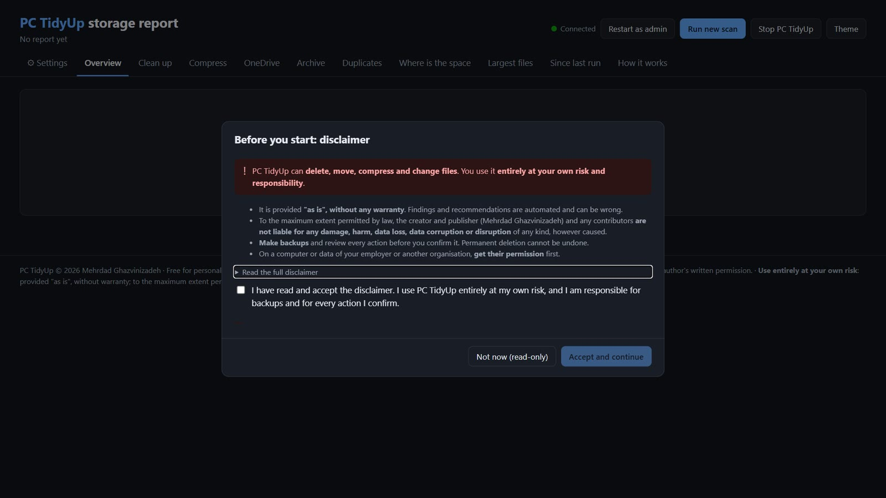

# PC TidyUp: user guide

## Starting

| How | What you get |
|---|---|
| Double-click **`PC-TidyUp.cmd`** | The live app: report plus actions in your browser at `http://127.0.0.1:8765` |
| Right-click `PC-TidyUp.cmd` > *Run as administrator* | The same, including system folders (`C:\Windows\Temp`, the Windows Update cache, …) |
| `.\Run-TidyUp.ps1 -Open` | A headless scan; opens the static report (read-only) |
| `.\Register-TidyUpTask.ps1` | A weekly headless scan (Mondays 12:30), so a fresh report is always waiting |

Keep the console window open while you use the page. Starting `PC-TidyUp.cmd` a second time reopens the running app instead of starting another one. The app stops by itself 20 minutes after the last page is closed, or when you click **Stop PC TidyUp**.

On first start, the app shows the **disclaimer**. You must accept it before PC TidyUp scans or acts: you use the tool entirely at your own risk, and you're responsible for backups and for every action you confirm (see [DISCLAIMER.md](../DISCLAIMER.md)). Until then the page is read-only.



The first time, the page shows **Run the first scan**. A full drive takes a few minutes, and the progress bar, counters and current folder update live. When the scan is done, the report appears in place.

## The tabs

| Tab | What it shows |
|---|---|
| ⚙ **Settings** | All configuration and your rules (see [Settings](#settings)) |
| **Overview** | Disk health, the **Priority guide**, where the gains are, file types, last-use age |
| **Clean up** | Everything the rules recognised, filterable by *Low risk*, *Likely obsolete*, *Your decision* and *Windows-managed* |
| **Compress** | Large, unused, compressible files (logs, CSV/JSON/XML, databases, VHDX, …) with an estimated saving |
| **OneDrive** | Synced files stored locally but unused for 6+ months |
| **Archive** | Large files unused for a year, plus the list of everything you archived, with **Restore** |
| **Duplicates** | Identical files in your own content; at least one copy is always kept |
| **Where is the space** | An expandable folder tree and the top file extensions |
| **Largest files** | The 100 biggest files |
| **Since last run** | Folders that grew or shrank by 200 MB or more, and the change in free space |
| **How it works** | Scan statistics and short explanations |

Every path has a **copy** button and an **open** button. *Open* shows the folder in File Explorer, or opens the containing folder with the file selected.

### Priority guide

| | Meaning | Typical items |
|---|---|---|
| **!! P1 Do now** | Big (≥ 500 MB) and low risk (not zero: close apps first) | Package and app caches, temp, stale OneDrive files |
| **! P2 Quick check** | Probably obsolete: glance, then act | Old logs, dumps, installers, stale build output |
| **? P3 Decide** | Needs your judgement | Backups, AI models, installer caches, archive candidates, duplicates |
| **· P4 Optional** | Small gains | Everything else |

**▲ grew** marks items that grew since the last scan. You can change the thresholds in Settings → *Priorities & disk health*.

## Actions

Tick items in any list, or use a lane's **Clean up all …** button. The bar at the bottom shows what can be done with the selection. Every action asks for confirmation, shows live progress, and marks each item ✓ or ✗ with the reason.

| Action | What happens |
|---|---|
| **Delete → Move to Recycle Bin** | Can be undone, but the space only comes back once you empty the bin. Refused if the Recycle Bin is turned off. Items bigger than the bin are skipped, never deleted silently. |
| **Delete → Delete permanently** | Frees space immediately and needs an extra confirmation tick. Tools are used where a rule names one (`npm cache clean`, `dotnet nuget locals …`). |
| **Compress → ZIP & remove original** | Writes `name.zip`, verifies it, then removes the original. The original is kept if the gain is under 10%. |
| **Compress → NTFS compression** | Files stay usable in place (`compact /c`). Not used inside OneDrive. |
| **Archive to OneDrive** | See below |
| **Make online-only** | OneDrive "Free up space": the file stays in the cloud and in Explorer |
| **Restore** (Archive tab) | Brings an archived item back to its original place |

**"Low risk" doesn't mean "no risk".** It marks caches and temp files that apps rebuild by themselves. They are still deleted for real, and an app might keep something there you'd miss. Caches of browsers, Visual Studio, VS Code and similar apps are **skipped while the app is running**. Keep backups, and prefer *Move to Recycle Bin* when in doubt.

Before anything is deleted, PC TidyUp checks again that the item is still old enough for its rule. Anything changed more recently is kept. Locked files are skipped, and the result tells you to close the app that's using them.

### Archive to OneDrive

1. The item is **moved** (on the same drive this is instant) under one common folder, by default `<your OneDrive>\TidyUp Archive`, keeping its original path: `C:\Users\me\old.iso` becomes `…\TidyUp Archive\C\Users\me\old.iso`.
2. It is flagged **online-only**: OneDrive uploads it, then frees the local space.
3. Optionally a **link is left at the old location**, so paths keep working: a junction for folders, a symbolic link for files. Symbolic links need *Developer Mode*; without it, PC TidyUp creates a `.lnk` shortcut instead.
4. Everything is listed in `reports\archive-manifest.json` and in `_TidyUp-Archive-Index.csv` inside the archive folder.

Refused: application data and system folders, items already in OneDrive, folders with more than 20,000 files (zip them first), names OneDrive doesn't accept, and paths over 400 characters.

## Settings

The **⚙ Settings** tab edits everything without opening a file:

- **Scan**: folders and drives to scan, duplicate detection, how "last used" is measured, how many reports to keep.
- **Thresholds**: what counts as big, old or worth listing, for compress, offload, archive, duplicates and the folder tree.
- **Priorities & disk health**: the P1/P2/P3 limits and when the drive counts as getting full or critical.
- **Archive to OneDrive**: the archive folder (with a preview of the resolved path), online-only, the default for leaving a link, and the folder size limit.
- **Protection & exclusions**: protected folders, application-data folders, duplicate exclusions, folders to skip, extra synced folders. `C:\Windows`, Program Files and ProgramData always stay protected.
- **App**: port and auto-stop time.
- **Rules**: add, edit, switch off or delete your own rules; switch off or customize built-in rules. See [Rules](rules.md).
- **Test a path**: shows which rules match a file or folder, whether it's protected or in OneDrive, and its category.

Values are checked before they're saved, and the previous file is kept as `.bak`. Scan settings and rules apply to the next scan. The port and the report folder apply the next time the app starts.

## Without the browser

```powershell
.\Run-TidyUp.ps1 -Open                      # scan the configured roots, open the static report
.\Run-TidyUp.ps1 -Root D:\ -NoDuplicates    # another drive, faster
python tidyup.py --help                     # the scanner itself
python tidyup.py --check-rules              # validate the rules
python tidyup.py --explain "C:\some\path"   # which rule matches
```

Each scan writes the following to `reports\`:

| File | What it is |
|---|---|
| `TidyUp-Report-<date>.html` / `.md` (+ `-latest`) | The report: interactive HTML, and Markdown for tickets or wikis |
| `cleanup\TidyUp-Cleanup-<date>.ps1` | A cleanup script for exactly what the report found |
| `history\` | Snapshots and data used for *Since last run* |

### The cleanup script

It's a **dry run by default**: it only lists what it would do. It re-checks the age of every item before acting.

```powershell
.\reports\cleanup\TidyUp-Cleanup-<date>.ps1                    # show what would happen
.\reports\cleanup\TidyUp-Cleanup-<date>.ps1 -Apply             # caches and temp only
.\reports\cleanup\TidyUp-Cleanup-<date>.ps1 -Apply -IncludeLikely
.\reports\cleanup\TidyUp-Cleanup-<date>.ps1 -Apply -IncludeReview    # read those items first
.\reports\cleanup\TidyUp-Cleanup-<date>.ps1 -Apply -IncludeOffload   # OneDrive: make stale files online-only
.\reports\cleanup\TidyUp-Cleanup-<date>.ps1 -Apply -Recycle          # Recycle Bin instead of permanent delete
```

### Weekly scan

```powershell
.\Register-TidyUpTask.ps1                              # every Monday 12:30
.\Register-TidyUpTask.ps1 -DayOfWeek Friday -At 16:00
.\Register-TidyUpTask.ps1 -Unregister
```

The task only scans and reports; it never deletes anything.

## Tips

- Close browsers, Teams, VS Code and Visual Studio before cleaning their caches, so the files aren't locked.
- *Since last run* compares only runs that scanned the same roots.
- `C:\Windows\WinSxS` looks bigger than it is because of hard links. Use the DISM command shown in its row.
- Antivirus scans can refresh the "last access" time of new files, so freshly downloaded files may look recently used.
